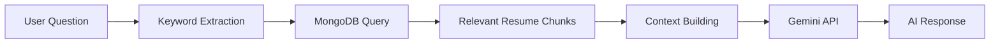

# KaiAssistant API

> A production-ready ASP.NET Core Web API with AI-powered assistant capabilities for Kai Taing's professional portfolio

[](https://dotnet.microsoft.com/)
[](LICENSE)
[](tests)
[](MCP_DEVELOPER_GUIDE.md)

## 📋 Table of Contents

- [Overview](#overview)
- [Features](#features)
- [Architecture](#architecture)
- [Tech Stack](#tech-stack)
- [Prerequisites](#prerequisites)
- [Getting Started](#getting-started)
- [Configuration](#configuration)
- [API Endpoints](#api-endpoints)
- [AI Assistant (RAG)](#ai-assistant-rag)
- [Testing](#testing)
- [Deployment](#deployment)
- [Security](#security)
- [Monitoring](#monitoring)
- [Project Structure](#project-structure)
- [Contributing](#contributing)
- [Documentation](#documentation)

---

## 🎯 Overview

KaiAssistant is a sophisticated backend API designed for Kai Taing's professional portfolio website. It provides AI-powered conversational capabilities using Google Gemini, allowing visitors to interact with an intelligent assistant that answers questions about Kai's professional background, skills, and experience using **Retrieval-Augmented Generation (RAG)**.

### Key Capabilities

- **AI-Powered Q&A**: Ask questions about Kai's background and receive intelligent, context-aware responses
- **Resume-as-Context (RAG)**: Retrieves relevant information from MongoDB-stored resume data
- **Contact Form**: Send messages directly via email
- **Health Monitoring**: Built-in health checks and Prometheus metrics
- **Production-Ready**: Comprehensive error handling, logging, and security features

---

## ✨ Features

### 🤖 AI Assistant (Gemini Integration)

- **MCP-Compliant**: Follows Model Context Protocol for AI interactions
- **Multi-Model Fallback**: Automatic failover between `gemini-2.0-flash` and `gemini-1.5-flash`
- **Smart RAG**: Keyword-based retrieval of relevant resume chunks from MongoDB
- **Privacy Controls**: Configurable personal detail filtering
- **Resilience Patterns**:
  - Exponential backoff with jitter
  - Circuit breaker (5 failures, 30s break)
  - 30-second HTTP timeout

### 📧 Contact Form

- **Email Delivery**: SMTP-based message forwarding via MailKit
- **Validation**: FluentValidation for request validation
- **Error Handling**: Graceful failure with user-friendly messages

### 🏥 Health & Monitoring

- **Health Endpoints**: `/api/health` for uptime checks
- **Prometheus Metrics**: OpenTelemetry integration for observability
- **Structured Logging**: Comprehensive logging at all layers

### 🔒 Security

- **Secret Management**: User secrets, environment variables, Azure Key Vault support
- **CORS**: Configurable cross-origin policies
- **Exception Handling**: Global middleware for consistent error responses
- **Input Validation**: FluentValidation across all inputs

---

## 🏗️ Architecture

This project follows **Domain-Driven Design (DDD)** and **Clean Architecture** principles:

```
┌─────────────────────────────────────────────────────────┐
│                     KaiAssistant.API                    │
│  (Controllers, Middleware, HTTP Concerns)               │
└────────────────────┬────────────────────────────────────┘
                     │
┌────────────────────▼────────────────────────────────────┐
│              KaiAssistant.Application                   │
│  (Business Logic, Commands, Queries, Services)          │
│  - AssistantService (AI/RAG)                            │
│  - EmailService                                         │
│  - MediatR Handlers                                     │
└────────────────────┬────────────────────────────────────┘
                     │
        ┌────────────┴────────────┐
        ▼                         ▼
┌───────────────┐        ┌────────────────────────┐
│  Domain       │        │  Infrastructure        │
│  (Entities)   │◄───────┤  (External Concerns)   │
│  - Resume     │        │  - MongoDB             │
│  - Contact    │        │  - Gemini Gateway      │
│  - Settings   │        │  - Email SMTP          │
└───────────────┘        └────────────────────────┘
```

### Layer Responsibilities

| Layer              | Responsibility                                 | Dependencies                |
| ------------------ | ---------------------------------------------- | --------------------------- |
| **API**            | HTTP endpoints, middleware, exception handling | Application, Infrastructure |
| **Application**    | Business logic, use cases, service interfaces  | Domain                      |
| **Domain**         | Core entities, business rules, interfaces      | None                        |
| **Infrastructure** | External integrations (DB, AI, Email)          | Domain, Application         |

---

## 🛠️ Tech Stack

### Core Framework

- **.NET 10.0** - Latest .NET framework
- **ASP.NET Core** - Web API framework
- **C# 13** - Language features

### AI & Data

- **Google Gemini API** - AI language model (2.0-flash, 1.5-flash)
- **MongoDB 3.0.0** - Document database for resume storage
- **RAG Pattern** - Retrieval-Augmented Generation

### Patterns & Libraries

- **MediatR 12.5.0** - CQRS pattern implementation
- **FluentValidation 11.11.0** - Request validation
- **Polly 8.2.0** - Resilience patterns (retry, circuit breaker)
- **MailKit 4.12.1** - Email delivery

### Testing

- **xUnit 2.6.2** - Test framework
- **FluentAssertions 6.9.0** - Fluent assertion library
- **Moq 4.18.4** - Mocking framework
- **Mongo2Go 4.0.0** - In-memory MongoDB for testing

### Observability

- **OpenTelemetry** - Distributed tracing
- **Prometheus** - Metrics collection
- **Serilog-compatible** - Structured logging

### DevOps

- **Docker** - Containerization
- **Multi-stage builds** - Optimized container images

---

## 📦 Prerequisites

- **.NET 10.0 SDK** ([Download](https://dotnet.microsoft.com/download/dotnet/10.0))
- **MongoDB** (Local or Atlas)
- **Google Gemini API Key** ([Get Key](https://makersuite.google.com/app/apikey))
- **SMTP Server** (Gmail, SendGrid, etc.)
- **Docker** (Optional, for containerization)

---

## 🚀 Getting Started

### 1. Clone the Repository

```bash
git clone https://github.com/Kheang1409/ContactFormApi.git
cd ContactFormApi
```

### 2. Configure Secrets

**Option A: User Secrets (Development)**

```bash
cd KaiAssistant.API

# Initialize user secrets
dotnet user-secrets init

# Set required secrets
dotnet user-secrets set "GeminiSettings:ApiKey" "YOUR_GEMINI_API_KEY"
dotnet user-secrets set "EmailSettings:SenderPassword" "YOUR_EMAIL_PASSWORD"
dotnet user-secrets set "EmailSettings:ReceiverEmail" "recipient@example.com"
dotnet user-secrets set "EmailSettings:SenderEmail" "sender@example.com"
dotnet user-secrets set "MongoDB:ConnectionString" "mongodb://localhost:27017"
dotnet user-secrets set "MongoDB:DatabaseName" "kai-portfolio"
```

**Option B: Environment Variables (Production)**

```powershell
# PowerShell
$env:GEMINI_API_KEY = "YOUR_GEMINI_API_KEY"
$env:MONGODB__CONNECTIONSTRING = "mongodb://localhost:27017"
```

> **📖 Detailed Security Setup**: See [SECURITY_SETUP.md](SECURITY_SETUP.md)

### 3. Restore Dependencies

```bash
dotnet restore
```

### 4. Build the Project

```bash
dotnet build
```

### 5. Run the API

```bash
dotnet run --project KaiAssistant.API
```

The API will be available at:

- **HTTP**: `http://localhost:5000`
- **HTTPS**: `https://localhost:5001`
- **Swagger UI**: `http://localhost:5000/swagger` (Development only)

---

## ⚙️ Configuration

### appsettings.json Structure

```json
{
  "GeminiSettings": {
    "ApiKey": "**", // Set via secrets!
    "ModelNames": [
      "gemini-2.0-flash:generateContent",
      "gemini-1.5-flash:generateContent"
    ],
    "Endpoint": "https://generativelanguage.googleapis.com/v1beta/models/",
    "SystemPrompt": "You are Kai Taing's professional AI assistant...",
    "PromptMaxChars": 10000,
    "IncludePersonalDetails": true,
    "Temperature": 0.4,
    "TopK": 20,
    "TopP": 0.85,
    "MaxOutputTokens": 768,
    "CandidateCount": 1
  },
  "EmailSettings": {
    "SmtpServer": "smtp.gmail.com",
    "Port": 465,
    "SenderEmail": "**",
    "ReceiverEmail": "**",
    "SenderPassword": "**",
    "Enabled": true
  },
  "MongoDB": {
    "ConnectionString": "**",
    "DatabaseName": "**"
  },
  "Cors": {
    "AllowedOrigins": ["http://localhost:4200"]
  }
}
```

### Environment Variables

Override any setting using environment variables:

```bash
GEMINI_API_KEY=your-key
GEMINI_TEMPERATURE=0.5
MONGODB__CONNECTIONSTRING=mongodb://localhost:27017
EMAIL__SMTPSERVER=smtp.gmail.com
```

**Naming Convention**: Use double underscores (`__`) for nested properties.

---

## 🌐 API Endpoints

### 🤖 AI Assistant

#### `POST /api/assistants/ask`

Ask questions about Kai's professional background.

**Request Body:**

```json
{
  "message": "What technologies do you specialize in?"
}
```

**Response:**

```json
{
  "response": "I specialize in backend development with C#, .NET, and Azure. I have extensive experience building scalable microservices..."
}
```

**Features:**

- Automatic resume context retrieval (RAG)
- Multi-model fallback
- Privacy-aware responses
- Conversational AI using Gemini

---

### 📧 Contact Form

#### `POST /api/contacts`

Send a contact message via email.

**Request Body:**

```json
{
  "name": "John Doe",
  "email": "john@example.com",
  "subject": "Collaboration Opportunity",
  "message": "Hi Kai, I'd like to discuss a project..."
}
```

**Response:**

```json
{
  "message": "Email sent successfully."
}
```

**Validation:**

- Name: Required, max 100 chars
- Email: Required, valid email format
- Subject: Required, max 200 chars
- Message: Required, max 5000 chars

---

### 🏥 Health Check

#### `GET /api/health`

#### `HEAD /api/health`

Check API health status.

**Response:**

```json
{
  "status": "Healthy"
}
```

---

### 📊 Metrics

#### `GET /metrics`

Prometheus-compatible metrics endpoint.

**Metrics Exposed:**

- HTTP request duration
- Request count by endpoint
- Active connections
- Custom application metrics

---

## 🧠 AI Assistant (RAG)

### How It Works

The AI assistant uses **Retrieval-Augmented Generation (RAG)** to provide accurate, context-aware responses:



### RAG Pipeline

1. **Question Analysis**: Extract keywords and intent
2. **Chunk Retrieval**: Query MongoDB for relevant resume sections
3. **Context Ranking**: Score chunks by relevance (0-10 scale)
4. **Context Limiting**: Keep top 8 chunks within token limits
5. **Prompt Construction**: Build MCP-compliant request
6. **AI Generation**: Send to Gemini with fallback
7. **Response Parsing**: Extract and return clean text

### Resume Data Structure

```json
{
  "_id": "ObjectId",
  "summary": "Software Engineer with 10 years...",
  "skills": ["C#", ".NET", "Azure", "Docker"],
  "experiences": [
    {
      "company": "Tech Corp",
      "position": "Senior Developer",
      "startDate": "2020-01",
      "endDate": "2024-12",
      "bulletPoints": ["Led team of 5...", "Improved performance by 40%"]
    }
  ],
  "education": [...],
  "certifications": [...],
  "projects": [...]
}
```

### Chunk Storage

Resume data is split into semantic chunks:

- **Label**: "Experience at Tech Corp", "Skills", "Education"
- **Content**: Actual text content
- **Source**: Reference to original document
- **Max Chunk Size**: 500 characters

### Model Fallback Strategy

```csharp
ModelNames: [
  "gemini-2.0-flash:generateContent",  // Try first (faster, newer)
  "gemini-1.5-flash:generateContent"   // Fallback (stable)
]
```

If the first model fails (rate limit, error), automatically tries the next.

### MCP Compliance

All Gemini requests follow **Model Context Protocol (MCP)**:

```json
{
  "contents": [
    {"role": "user", "parts": [{"text": "System prompt..."}]},
    {"role": "user", "parts": [{"text": "Resume context + question"}]}
  ],
  "generationConfig": {
    "temperature": 0.4,
    "topK": 20,
    "topP": 0.85,
    "maxOutputTokens": 768,
    "candidateCount": 1
  },
  "safetySettings": [...]
}
```

> **📖 MCP Details**: See [MCP_DEVELOPER_GUIDE.md](MCP_DEVELOPER_GUIDE.md)

---

## 🧪 Testing

### Run All Tests

```bash
dotnet test
```

### Run Unit Tests Only

```bash
dotnet test --filter "Category!=Integration"
```

### Run Specific Test

```bash
dotnet test --filter "Name~AskQuestionAsync"
```

### Test Coverage

| Category              | Tests  | Coverage                                     |
| --------------------- | ------ | -------------------------------------------- |
| **Unit Tests**        | 10     | AssistantService, Validation, Error Handling |
| **Integration Tests** | 7      | Full RAG flow, MCP compliance, End-to-end    |
| **Total**             | **17** | **100% passing** ✅                          |

### Key Test Scenarios

✅ Valid questions → AI responses  
✅ Empty questions → validation errors  
✅ No resume data → graceful degradation  
✅ Gateway failures → error messages  
✅ MCP payload validation  
✅ CamelCase config verification  
✅ Contents array ordering  
✅ Safety settings compliance

---

## 🐳 Deployment

### Docker

#### Build Image

```bash
docker build -t kaiassistant-api:latest .
```

#### Run Container

```bash
docker run -d -p 8080:8080 \
  -e GEMINI_API_KEY=your-key \
  -e MONGODB__CONNECTIONSTRING=mongodb://host.docker.internal:27017 \
  -e EMAIL__SENDERPASSWORD=your-password \
  --name kaiassistant \
  kaiassistant-api:latest
```

#### Docker Compose

```yaml
version: "3.8"

services:
  api:
    build: .
    ports:
      - "8080:8080"
    environment:
      - GEMINI_API_KEY=${GEMINI_API_KEY}
      - MONGODB__CONNECTIONSTRING=mongodb://mongo:27017
      - EMAIL__SENDERPASSWORD=${EMAIL_PASSWORD}
    depends_on:
      - mongo

  mongo:
    image: mongo:7
    ports:
      - "27017:27017"
    volumes:
      - mongo-data:/data/db

volumes:
  mongo-data:
```

Run with:

```bash
docker-compose up -d
```

### Azure Deployment

#### App Service

```bash
# Login to Azure
az login

# Create resource group
az group create --name KaiAssistantRG --location eastus

# Create App Service plan
az appservice plan create --name KaiAssistantPlan --resource-group KaiAssistantRG --sku B1 --is-linux

# Create web app
az webapp create --resource-group KaiAssistantRG --plan KaiAssistantPlan --name kaiassistant-api --runtime "DOTNETCORE:10.0"

# Configure app settings
az webapp config appsettings set --resource-group KaiAssistantRG --name kaiassistant-api --settings \
  GEMINI_API_KEY="your-key" \
  MONGODB__CONNECTIONSTRING="your-connection-string"

# Deploy
az webapp deployment source config-zip --resource-group KaiAssistantRG --name kaiassistant-api --src publish.zip
```

#### Azure Container Apps

```bash
# Create container app
az containerapp create \
  --name kaiassistant \
  --resource-group KaiAssistantRG \
  --image kaiassistant-api:latest \
  --environment production \
  --ingress external \
  --target-port 8080 \
  --secrets \
    gemini-api-key="your-key" \
    mongo-connection="your-connection"
```

---

## 🔒 Security

### Best Practices Implemented

✅ **No Hardcoded Secrets**: All sensitive data via secrets management  
✅ **CORS Protection**: Configurable allowed origins  
✅ **Input Validation**: FluentValidation on all requests  
✅ **Exception Handling**: Global middleware prevents info leakage  
✅ **HTTPS**: Configurable SSL/TLS enforcement  
✅ **Rate Limiting**: Circuit breaker prevents abuse  
✅ **Secret Rotation**: Environment variable support

### Secret Management Options

1. **Development**: .NET User Secrets
2. **Production**: Environment Variables
3. **Azure**: Azure Key Vault
4. **Docker**: Docker secrets or .env files

> **📖 Complete Security Guide**: See [SECURITY_SETUP.md](SECURITY_SETUP.md)

---

## 📊 Monitoring

### Prometheus Metrics

Exposed at `/metrics`:

```prometheus
# HTTP request duration
http_request_duration_seconds_bucket{method="POST",endpoint="/api/assistants/ask"}

# Request count
http_requests_total{method="POST",endpoint="/api/assistants/ask",status="200"}

# Active connections
http_server_active_requests

# Custom metrics
kaiassistant_rag_chunks_retrieved
kaiassistant_gemini_model_fallback_count
```

### Logging

Structured logging with levels:

- **Information**: Normal operations, resume loaded, responses
- **Warning**: Missing data, model fallbacks
- **Error**: Failures, exceptions
- **Debug**: Request/response details (dev only)

### Health Checks

Monitor via `/api/health`:

```bash
curl http://localhost:5000/api/health
# Returns 200 OK if healthy
```

---

## 📁 Project Structure

```
KaiAssistant/
├── KaiAssistant.API/                    # 🌐 Web API Layer
│   ├── Controllers/
│   │   ├── AssistantController.cs       # AI assistant endpoints
│   │   ├── ContactController.cs         # Contact form endpoints
│   │   └── HealthController.cs          # Health check endpoint
│   ├── Middleware/
│   │   └── GlobalExceptionMiddleware.cs # Error handling
│   ├── Extensions/
│   │   └── CorsServiceCollectionExtensions.cs
│   ├── Program.cs                       # App entry point
│   └── appsettings.json                 # Configuration
│
├── KaiAssistant.Application/            # 💼 Business Logic Layer
│   ├── AskAssistants/
│   │   ├── Commands/
│   │   │   ├── AskAssistantCommand.cs
│   │   │   └── AskAssistantCommandHandler.cs
│   │   └── Validators/
│   ├── Contacts/
│   │   ├── Commands/
│   │   │   └── ContactCommand.cs
│   │   └── Handlers/
│   │       └── ContactCommandHandler.cs
│   ├── Services/
│   │   ├── AssistantService.cs          # RAG implementation
│   │   ├── AiPromptBuilder.cs           # MCP payload builder
│   │   ├── EmailService.cs              # Email delivery
│   │   ├── GeminiAiModelGatewayAdapter.cs
│   │   └── ResumeContextProvider.cs     # Resume chunk retrieval
│   ├── Interfaces/
│   │   ├── IAssistantService.cs
│   │   ├── IAiModelGateway.cs
│   │   └── IResumeContextProvider.cs
│   └── DTOs/
│       └── TextDto.cs
│
├── KaiAssistant.Domain/                 # 🏛️ Domain Layer
│   ├── Entities/
│   │   ├── Resume.cs
│   │   ├── Experience.cs
│   │   ├── Education.cs
│   │   ├── GeminiSettings.cs
│   │   └── EmailSettings.cs
│   └── Interfaces/
│       └── Repositories/
│           └── IResumeRepository.cs
│
├── KaiAssistant.Infrastructure/         # 🔧 Infrastructure Layer
│   ├── Gateways/
│   │   └── GeminiGateway.cs            # Gemini API integration
│   ├── Persistence/
│   │   ├── Repositories/
│   │   │   └── ResumeRepository.cs     # MongoDB repository
│   │   └── ServiceCollectionExtensions.cs
│   ├── Extensions/
│   │   ├── AssistantServiceCollectionExtensions.cs
│   │   ├── EmailServiceCollectionExtensions.cs
│   │   └── MongoServiceCollectionExtensions.cs
│   └── Mongo/
│       └── MongoContext.cs
│
├── KaiAssistant.Tests/                  # 🧪 Test Project
│   ├── AssistantServiceTests.cs         # Unit tests
│   ├── AiPromptBuilderTests.cs
│   ├── ResumeContextProviderTests.cs
│   └── ServiceRegistrationTests.cs
│
├── Dockerfile                           # 🐳 Container definition
├── KaiAssistant.sln                    # Solution file
├── MCP_DEVELOPER_GUIDE.md              # MCP documentation
├── SECURITY_SETUP.md                   # Security guide
└── README.md                           # This file
```

---

## 🤝 Contributing

Contributions are welcome! Please follow these guidelines:

### Development Workflow

1. **Fork** the repository
2. **Create** a feature branch (`git checkout -b feature/amazing-feature`)
3. **Commit** your changes (`git commit -m 'Add amazing feature'`)
4. **Push** to the branch (`git push origin feature/amazing-feature`)
5. **Open** a Pull Request

### Coding Standards

- Follow **C# naming conventions**
- Use **async/await** for all I/O operations
- Add **XML documentation** for public APIs
- Write **unit tests** for new features
- Ensure **all tests pass** before submitting PR

### Pull Request Checklist

- [ ] Code follows project conventions
- [ ] Tests added for new functionality
- [ ] All tests passing (`dotnet test`)
- [ ] Build succeeds (`dotnet build`)
- [ ] Documentation updated
- [ ] No secrets in code

---

## 📚 Documentation

| Document                                                 | Description                                   |
| -------------------------------------------------------- | --------------------------------------------- |
| [MCP_DEVELOPER_GUIDE.md](MCP_DEVELOPER_GUIDE.md)         | Model Context Protocol implementation details |
| [SECURITY_SETUP.md](SECURITY_SETUP.md)                   | Complete security configuration guide         |
| [IMPLEMENTATION_COMPLETE.md](IMPLEMENTATION_COMPLETE.md) | Recent improvements and architecture changes  |

---

## 🐛 Troubleshooting

### Common Issues

#### 1. "Email setting 'ReceiverEmail' is missing"

**Solution**: Configure email settings via user secrets or environment variables.

```bash
dotnet user-secrets set "EmailSettings:ReceiverEmail" "your-email@example.com"
```

#### 2. "MongoDB connection failed"

**Solution**: Ensure MongoDB is running and connection string is correct.

```bash
# Check MongoDB status
mongod --version

# Test connection
mongo mongodb://localhost:27017
```

#### 3. "Gemini API key invalid"

**Solution**: Verify your API key at [Google AI Studio](https://makersuite.google.com/).

```bash
dotnet user-secrets set "GeminiSettings:ApiKey" "YOUR_VALID_KEY"
```

#### 4. "CORS policy blocked"

**Solution**: Add your frontend URL to `appsettings.json`:

```json
{
  "Cors": {
    "AllowedOrigins": ["http://localhost:4200", "https://yoursite.com"]
  }
}
```

---

## 📄 License

This project is licensed under the MIT License - see the [LICENSE](LICENSE) file for details.

---

## 👨‍💻 Author

**Kai Taing**

- Portfolio: [kaitaing.com](https://kaitaing.com)
- GitHub: [@Kheang1409](https://github.com/Kheang1409)
- LinkedIn: [Kai Taing](https://linkedin.com/in/kaitaing)

---

## 🙏 Acknowledgments

- **Google Gemini** - AI language model
- **MongoDB** - Document database
- **Microsoft** - .NET platform
- **MediatR** - CQRS pattern implementation
- **Polly** - Resilience framework
- **Community** - Open source contributors

---

## 📈 Roadmap

### Planned Features

- [ ] **Vector Search**: Semantic search using embeddings
- [ ] **Caching**: Redis integration for response caching
- [ ] **Multi-Language**: Support for multiple languages
- [ ] **WebSockets**: Real-time chat capabilities
- [ ] **Authentication**: JWT-based API authentication
- [ ] **Rate Limiting**: Per-user rate limiting
- [ ] **Analytics**: User interaction tracking
- [ ] **A/B Testing**: Model performance comparison

---

## 💬 Support

For questions, issues, or feature requests:

1. **GitHub Issues**: [Create an issue](https://github.com/Kheang1409/ContactFormApi/issues)
2. **Email**: contact@kaitaing.com
3. **Documentation**: Check [MCP_DEVELOPER_GUIDE.md](MCP_DEVELOPER_GUIDE.md)

---

<p align="center">
  Made with ❤️ by <a href="https://github.com/Kheang1409">Kai Taing</a>
</p>

<p align="center">
  <a href="#-table-of-contents">Back to Top ⬆️</a>
</p>
