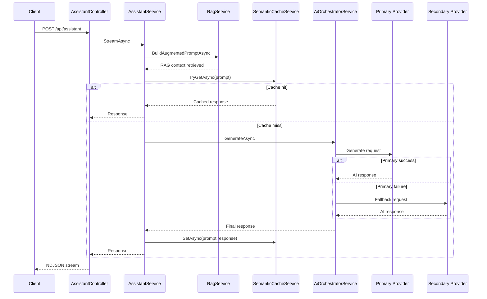

# AI Flow Diagram

```mermaid
sequenceDiagram
    participant C as Client
    participant A as AssistantController
    participant S as AssistantService
    participant R as RagService
    participant SC as SemanticCacheService
    participant O as AiOrchestratorService
    participant P1 as Primary Provider
    participant P2 as Secondary Provider

    C->>A: POST /api/assistant
    A->>S: StreamAsync
    S->>R: BuildAugmentedPromptAsync
    R-->>S: RAG context retrieved
    S->>SC: TryGetAsync(prompt)

    alt Cache hit
        SC-->>S: Cached response
        S-->>A: Response
    else Cache miss
        S->>O: GenerateAsync
        O->>P1: Generate request
        alt Primary success
            P1-->>O: AI response
        else Primary failure
            O->>P2: Fallback request
            P2-->>O: AI response
        end
        O-->>S: Final response
        S->>SC: SetAsync(prompt,response)
        S-->>A: Response
    end

    A-->>C: NDJSON stream
```
