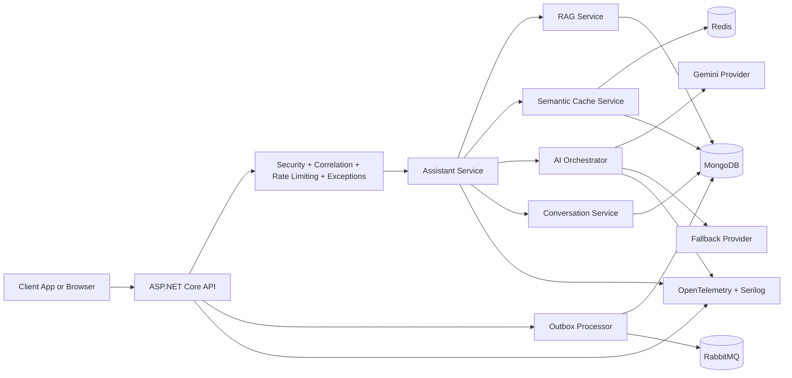

# System Diagram

```mermaid
flowchart LR
    Client[Client App or Browser] --> API[ASP.NET Core API]
    API --> Middleware[Security + Correlation + Rate Limiting + Exceptions]
    Middleware --> Assistant[Assistant Service]

    Assistant --> Rag[RAG Service]
    Assistant --> SemCache[Semantic Cache Service]
    Assistant --> Orchestrator[AI Orchestrator]
    Assistant --> Memory[Conversation Service]

    Rag --> Mongo[(MongoDB)]
    SemCache --> Redis[(Redis)]
    SemCache --> Mongo
    Memory --> Mongo

    Orchestrator --> ProviderA[Gemini Provider]
    Orchestrator --> ProviderB[Fallback Provider]

    API --> Outbox[Outbox Processor]
    Outbox --> Mongo
    Outbox --> Rabbit[(RabbitMQ)]

    API --> Obs[OpenTelemetry + Serilog]
    Assistant --> Obs
    Orchestrator --> Obs
```
