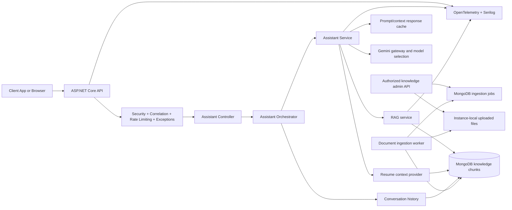

# System Diagram

```mermaid
flowchart LR
    Client[Client App or Browser] --> API[ASP.NET Core API]
    API --> Middleware[Security + Correlation + Rate Limiting + Exceptions]
    Middleware --> Controller[Assistant Controller]
    Controller --> Orchestrator[Assistant Orchestrator]
    Orchestrator --> Assistant[Assistant Service]

    Assistant --> Resume[Resume context provider]
    Assistant --> Rag[RAG service]
    Assistant --> PromptCache[Prompt/context response cache]
    Assistant --> Gemini[Gemini gateway and model selection]
    Rag --> Mongo[(MongoDB knowledge chunks)]
    Resume --> Mongo
    Orchestrator --> Conversation[Conversation history]
    Conversation --> Mongo

    Admin[Authorized knowledge admin API] --> LocalFiles[Instance-local uploaded files]
    Admin --> MongoJobs[MongoDB ingestion jobs]
    Worker[Document ingestion worker] --> MongoJobs
    Worker --> LocalFiles
    Worker --> Mongo

    API --> Obs[OpenTelemetry + Serilog]
    Assistant --> Obs
    Rag --> Obs
```

The tool-calling prototype, semantic response cache, RabbitMQ publisher, and outbox worker are not wired into this active request path.
