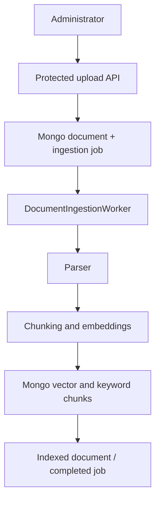

# Durable document ingestion

The upload command writes a document record and durable job before returning `202 Accepted`. The worker atomically claims eligible jobs with a Mongo lease, so multiple instances cannot process the same active lease. Expired processing leases become eligible again.

Failures are retried with exponential backoff and jitter. After `MaxAttempts`, the job moves to `DeadLetter`; document content and embeddings are never logged. Local file storage is the development implementation of `IDocumentStorage`; production deployments should supply shared object storage.
